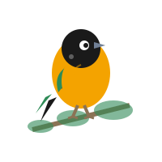

# 🐦 Tourpial Birding



**Descubre el mundo de las aves silvestres en Norte de Santander**

Sitio web profesional para experiencias de aviturismo sostenible, guiadas por expertos apasionados por la conservación y la aventura.

---

## 📋 Descripción del Proyecto

Tourpial Birding es un proyecto universitario de la asignatura **Ingeniería de Sistemas** que presenta una plataforma web moderna para promover el aviturismo (birdwatching) en Norte de Santander, Colombia. El proyecto conecta a exploradores de la naturaleza con las aves más fascinantes de la región, mientras protege sus hábitats y apoya a las comunidades locales.

### 👥 Equipo de Desarrollo

- **María Camila Leal**
- **Daniel Facundo Mirando**
- **Christian Sneider Blanco**
- **Kevin Sneyder Hernández**

---

## ✨ Características Principales

- ✅ **Diseño Responsivo**: Optimizado para dispositivos móviles, tabletas y escritorio
- ✅ **Identidad de Marca**: Paleta de colores basada en el Turpial Toche (verde esmeralda, naranja dorado)
- ✅ **Navegación Fluida**: Menú sticky con smooth scrolling
- ✅ **Secciones Completas**:
  - Hero con presentación impactante
  - Misión y valores fundamentales
  - Servicios ofrecidos
  - Experiencias en la naturaleza
  - Tours (próximamente)
  - Formulario de contacto
- ✅ **Animaciones**: Efectos suaves al hacer scroll
- ✅ **SEO Optimizado**: Meta tags y estructura semántica HTML5
- ✅ **Accesibilidad**: ARIA labels y navegación por teclado

---

## 🎨 Paleta de Colores

| Color | Hex | Uso |
|-------|-----|-----|
| Verde Esmeralda | `#2E8B57` | Color primario, naturaleza |
| Naranja Dorado | `#F4A300` | Color secundario, energía |
| Blanco | `#FFFFFF` | Texto sobre fondos oscuros |
| Negro | `#1a1a1a` | Texto principal |
| Gris | `#718096` | Texto secundario |

---

## 🚀 Despliegue en GitHub Pages

### Opción 1: Despliegue Automático (Recomendado)

1. **Subir el proyecto a GitHub**:
   ```bash
   git init
   git add .
   git commit -m "Initial commit: Tourpial Birding website"
   git branch -M main
   git remote add origin https://github.com/TU-USUARIO/tourpial-birding.git
   git push -u origin main
   ```

2. **Configurar GitHub Pages**:
   - Ve a tu repositorio en GitHub
   - Haz clic en **Settings** (Configuración)
   - En el menú lateral, selecciona **Pages**
   - En **Source**, selecciona la rama `main` y la carpeta `/ (root)`
   - Haz clic en **Save**
   - GitHub te proporcionará la URL: `https://TU-USUARIO.github.io/tourpial-birding/`

3. **Esperar el despliegue**:
   - GitHub Pages construirá tu sitio automáticamente
   - El proceso tarda entre 1-5 minutos
   - Recibirás una notificación cuando esté listo

### Opción 2: Usando GitHub Desktop

1. Abre **GitHub Desktop**
2. **File** > **Add Local Repository** y selecciona la carpeta del proyecto
3. Agrega un commit message: "Initial commit"
4. Haz clic en **Publish repository**
5. Sigue los pasos 2-3 de la Opción 1

---

## 📁 Estructura del Proyecto

```
PU-TourpialBirding/
├── index.html              # Página principal
├── css/
│   └── styles.css          # Estilos del sitio
├── js/
│   └── main.js             # Funcionalidades JavaScript
├── assets/
│   ├── logo.jpg            # Logo principal (1024x1024)
│   ├── favicon.svg         # Favicon del sitio
│   ├── bird-mission.jpg    # Imagen de misión
│   ├── bird-turpial.jpg    # Imagen del turpial
│   ├── bird-guided-discovery.jpeg    # Experiencia 1
│   ├── bird-deep-connection.jpeg     # Experiencia 2
│   └── bird-vivencial-learning.jpeg  # Experiencia 3
├── README.md               # Este archivo
└── Presentacion_descompuesta_imagenes/  # Slides del proyecto
```

---

## 🛠️ Tecnologías Utilizadas

- **HTML5**: Estructura semántica moderna
- **CSS3**: Estilos con variables CSS, Flexbox y Grid
- **JavaScript (Vanilla)**: Funcionalidades interactivas sin dependencias
- **SVG**: Gráficos vectoriales escalables para logos e imágenes
- **Font Awesome**: Iconos profesionales
- **Google Fonts**: Tipografías Merriweather y Open Sans

---

## 🌟 Funcionalidades JavaScript

- **Navegación Sticky**: El navbar se fija al hacer scroll
- **Menú Hamburguesa**: Para dispositivos móviles
- **Scroll Suave**: Navegación fluida entre secciones
- **Resaltado de Sección Activa**: Indica la sección actual en el menú
- **Botón Volver Arriba**: Aparece después de hacer scroll
- **Validación de Formulario**: Verifica campos antes de enviar
- **Animaciones de Entrada**: Elementos aparecen al hacer scroll
- **Manejo de Errores**: Placeholder automático para imágenes no encontradas

---

## 📱 Responsividad

El sitio está optimizado para:

- 📱 **Móviles**: < 480px
- 📱 **Tablets**: 481px - 768px
- 💻 **Escritorio**: > 769px

---

## 🔧 Personalización

### Cambiar Colores

Edita las variables CSS en `css/styles.css`:

```css
:root {
    --color-primary: #2E8B57;      /* Tu color primario */
    --color-secondary: #F4A300;    /* Tu color secundario */
    /* ... más colores ... */
}
```

### Reemplazar Imágenes

Las imágenes actuales son placeholders en formato SVG. Para usar tus propias imágenes:

1. Coloca tus imágenes en la carpeta `assets/`
2. Mantén los mismos nombres o actualiza las referencias en `index.html`
3. Formatos recomendados: JPG (fotos), PNG (imágenes con transparencia), SVG (logos)

### Modificar Contenido

Todo el contenido está en `index.html`. Las secciones están claramente comentadas:

- `<!-- Hero Section -->`: Página principal
- `<!-- Mission Section -->`: Sección de misión
- `<!-- Values Section -->`: Valores fundamentales
- Y más...

---

## 📧 Contacto y Soporte

Para preguntas sobre el proyecto:

- **Email del Proyecto**: info@tourpialbirding.com
- **Universidad**: [Nombre de tu universidad]
- **Asignatura**: Ingeniería de Sistemas

---

## 📝 Notas Importantes

### Para GitHub Pages:

1. **El archivo principal debe llamarse `index.html`** ✅ (Ya configurado)
2. **Todas las rutas son relativas** ✅ (Ya configurado)
3. **Los nombres de archivos son case-sensitive** (cuidado con mayúsculas/minúsculas)
4. **El sitio es estático**: No requiere servidor backend

### Limitaciones de GitHub Pages:

- ⚠️ No soporta código del lado del servidor (PHP, Python, etc.)
- ⚠️ El formulario de contacto es solo visual (necesita integración con servicio externo)
- ✅ Perfecto para sitios estáticos con HTML, CSS y JavaScript

### Mejoras Futuras Recomendadas:

1. **Integrar formulario**: Usar [Formspree](https://formspree.io/) o [EmailJS](https://www.emailjs.com/)
2. **Analytics**: Agregar Google Analytics para medir visitas
3. **Imágenes reales**: Reemplazar placeholders con fotografías profesionales
4. **Blog**: Añadir sección de noticias sobre avistamientos
5. **Sistema de reservas**: Para cuando los tours estén disponibles

---

## 🎓 Propósito Académico

Este proyecto fue desarrollado como parte de un curso universitario de Ingeniería de Sistemas, con el objetivo de aplicar conocimientos de:

- Desarrollo web frontend
- Diseño de interfaces de usuario (UI/UX)
- Control de versiones con Git
- Despliegue de aplicaciones web
- Gestión de proyectos en equipo

---

## 📄 Licencia

Este proyecto es de uso académico. Todos los derechos reservados © 2024 Tourpial Birding.

---

## 🙏 Agradecimientos

- Inspiración: [Pajareando.co](https://pajareando.co/)
- Iconos: [Font Awesome](https://fontawesome.com/)
- Fuentes: [Google Fonts](https://fonts.google.com/)
- Hospedaje: [GitHub Pages](https://pages.github.com/)

---

## 🐦 ¡Descubre el Mundo Que Vuela!

**Cada ave tiene una historia esperando ser descubierta.**

Visita el sitio: [Próximamente en GitHub Pages]

---

**Desarrollado con ❤️ por el equipo de Tourpial Birding**

